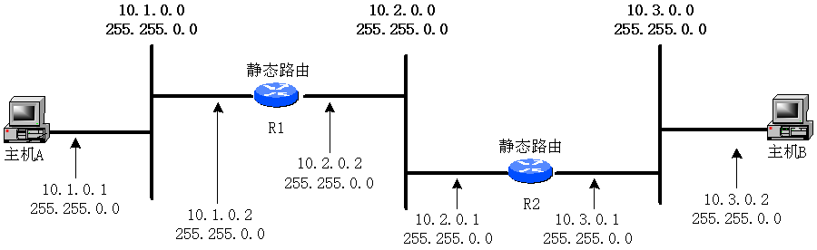
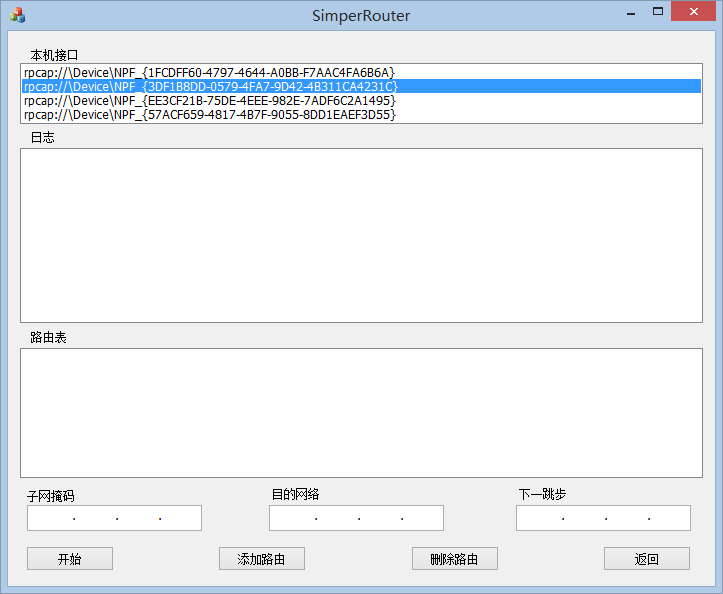
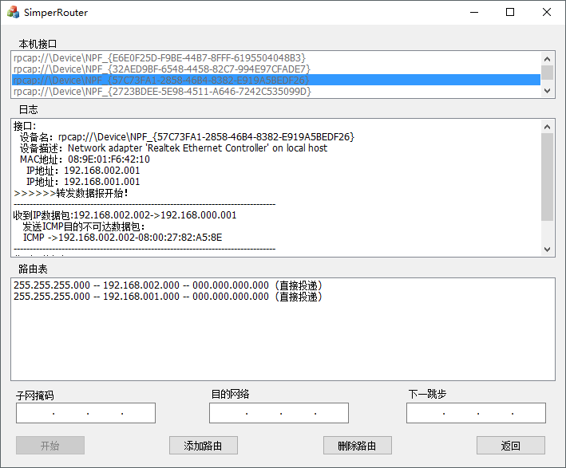

# Simple Router

**Language:** C++

**Platform:** Visual Studio 2010

## Overview

This is computer Networking course project. The purpose of this experiment is to write a simple router using visual C++ to implement IP datagram forwarding. The experiment can be performed in a LAN using the following environment:

The routers R1 and R2 are general-purpose computers connected to different subnets. Bind IPs through the routing programs running on R1 and R2. By adding routing tables through the routing programs, analyze and forward the received packets, and realize the communication between hosts I and II in different networks. The communication test is performed by the `ping` command, and the tracer + IP address can be used to trace the forwarding path of packets in the network.

## Demo

Running the Simple Router program:

Forwarding datagrams:

**Functions:**
- Basic requirements
    - `Static routing table maintenance`: static routing maintenance functions such as adding, modifying and deleting; automatically obtain the routing information directly connected to the local machine
    - `IP datagram processing`: IP datagram reception, routing, sending (including ARP resolution), etc.; ignore the slice processing, option processing, dynamic routing and other functions
    - `Logging`: display the local network interface, IP datagram reception, IP datagram routing, IP datagram transmission
- Extended implementation
    - Handle the TTL value of IP datagram
    - Recalculates the header checksum of IP datagrams
    - Generate and process the ICMP messages